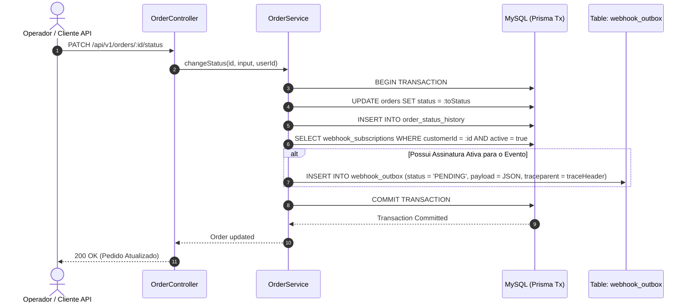
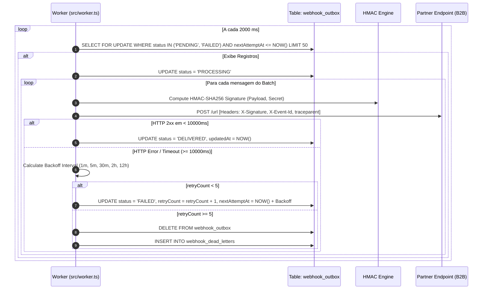
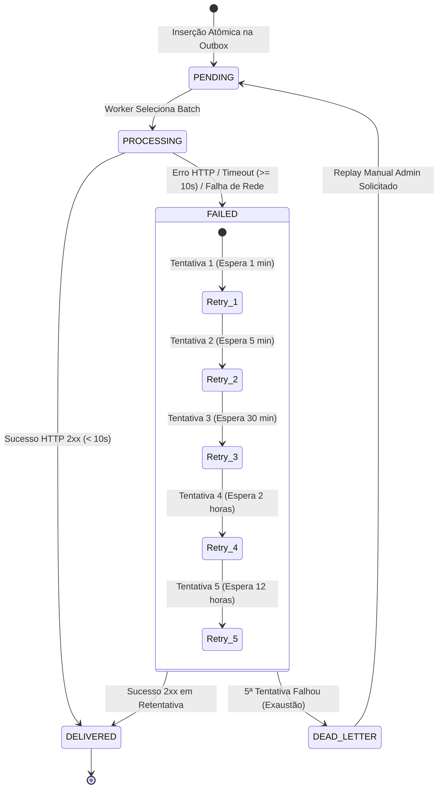

# FDD-001: Especificação Técnica do Sistema de Webhooks de Notificação de Pedidos

## 1. Contexto e Motivação Técnica
O OMS (Order Management System) é um monólito modular desenvolvido em Node.js com TypeScript, utilizando Express como framework HTTP, Prisma ORM para mapeamento objeto-relacional e MySQL 8 como banco de dados relacional. Toda a arquitetura do backend encontra-se organizada dentro do diretório `src/modules/`, dividida em módulos desacoplados como `auth`, `users`, `customers`, `products` e `orders`.

No modelo operacional corrente, o processamento do ciclo de vida dos pedidos é gerenciado pelo método `changeStatus` na classe `OrderService` em `src/modules/orders/order.service.ts`. A transição entre os estados do enum `OrderStatus` (`PENDING`, `PAID`, `PROCESSING`, `SHIPPED`, `DELIVERED`, `CANCELLED`) é realizada diretamente na base MySQL.

Para atender à necessidade de integração em tempo quase-real exigida pelos clientes B2B (Atlas Comercial, MaxDistribuição e Nova Cargo), o sistema precisa evoluir do modelo ineficiente de polling HTTP constante realizado pelos clientes para um modelo de notificações push assíncronas acionado por eventos. A execução de chamadas HTTP síncronas diretamente dentro da transação principal de alteração do pedido causaria acoplamento temporal, aumento inaceitável da latência do checkout/operação, risco de rollbacks em cascata provocados por indisponibilidade de terceiros e instabilidade operacional no OMS. 

Para resolver essa dor com resiliência, adota-se o **Transactional Outbox Pattern** combinado com um **Polling Worker autônomo**, garantindo desacoplamento transacional total, persistência atômica dos eventos e garantia de entrega.

---

## 2. Objetivos Técnicos
* **SLA de Latência Fim-a-Fim:** Latência total entre o commit da alteração de status no banco de dados e a entrega HTTP no endpoint do cliente B2B inferior a 10 segundos para 99% dos eventos (`p99 < 10s`).
* **Garantia de Entrega At-Least-Once:** Garantia rigorosa de zero perda de eventos auditáveis. Todo evento commitado na transação do pedido será obrigatoriamente persistido na tabela outbox e processado.
* **Isolamento Total de Falhas e Resiliência:** Isolamento completo do loop de execução da API. Indisponividades, lentidões ou erros em endpoints de terceiros não afetam o OMS. Retentativas são gerenciadas em segundo plano e falhas exauridas são isoladas na Dead Letter Queue (DLQ).
* **Integridade, Autenticidade e Segurança:** Assinatura digital de todos os payloads outbound utilizando **HMAC-SHA256** no cabeçalho `X-Signature`, segredos criptográficos únicos por assinatura com suporte a rotação em janela de tolerância (*grace period*) de 24 horas, e imposição estrita do protocolo HTTPS.

---

## 3. Escopo Técnico e Exclusões

### Em Escopo (Fase 1)
1. **Modelagem Prisma (`prisma/schema.prisma`):** Criação das tabelas `webhook_subscriptions`, `webhook_outbox` e `webhook_dead_letters` utilizando UUIDs formatados em `Char(36)`, colunas JSON flexíveis e índices otimizados `@@index([status, nextAttemptAt])`.
2. **Hooking Atômico Transacional:** Injeção da publicação do evento na outbox (`publishWebhookOutboxEvent`) dentro do bloco `this.prisma.$transaction` do método `OrderService.changeStatus`.
3. **Módulo de Gestão CRUD (`src/modules/webhooks/`):** Controllers, Services, Schemas de validação Zod e Rotas para cadastro de webhooks, edição, listagem de entregas e rotação de secret.
4. **Worker de Polling Autônomo (`src/worker.ts`):** Ponto de entrada totalmente desacoplado da API Web, executando em loop contínuo com intervalo de 2 segundos para leitura e processamento em lote (batch size: 50).
5. **Estratégia de Retentativas e DLQ:** Algoritmo de Backoff Exponencial em 5 retentativas (1m, 5m, 30m, 2h, 12h) e descarte seguro para a tabela de DLQ em caso de exaustão.
6. **Endpoint Admin de Replay:** Rota `POST /api/v1/admin/webhooks/dead-letter/:id/replay` protegida por autenticação JWT e controle de acesso RBAC exigindo role `ADMIN`.

### Exclusões Técnicas (Fase 1)
* Adição de message brokers dedicados externos (Redis Streams, RabbitMQ, Apache Kafka).
* Protocolos de comunicação síncrona bi-direcional ou streaming (WebSockets, gRPC, SSE).
* Interface gráfica ou dashboard visual no Frontend para acompanhamento de webhooks.
* Alertas automáticos por e-mail ou mensagens de texto em caso de falha de entrega.
* Rate limiting ativo por cliente no worker assíncrono (adiado para a Fase 2).

---

## 4. Integração Cirúrgica com o Sistema Existente (5 Arquivos Reais)

### 1. `prisma/schema.prisma`
Adição dos enums `WebhookStatus` e dos modelos `WebhookSubscription`, `WebhookOutbox` e `WebhookDeadLetter`:

```prisma
enum WebhookStatus {
  PENDING
  PROCESSING
  DELIVERED
  FAILED
}

model WebhookSubscription {
  id              String          @id @default(uuid()) @db.Char(36)
  customerId      String          @db.Char(36)
  url             String          @db.VarChar(500)
  secret          String          @db.VarChar(255)
  previousSecret  String?         @db.VarChar(255)
  secretExpiresAt DateTime?
  events          Json
  active          Boolean         @default(true)
  createdAt       DateTime        @default(now())
  updatedAt       DateTime        @updatedAt

  customer        Customer        @relation(fields: [customerId], references: [id], onDelete: Cascade)
  outboxEvents    WebhookOutbox[]

  @@index([customerId])
  @@index([active])
  @@map("webhook_subscriptions")
}

model WebhookOutbox {
  id             String              @id @default(uuid()) @db.Char(36)
  subscriptionId String              @db.Char(36)
  eventId        String              @default(uuid()) @db.Char(36)
  eventType      String              @db.VarChar(100)
  payload        Json
  status         WebhookStatus       @default(PENDING)
  retryCount     Int                 @default(0)
  nextAttemptAt  DateTime            @default(now())
  lastError      String?             @db.Text
  createdAt      DateTime            @default(now())
  updatedAt      DateTime            @updatedAt

  subscription   WebhookSubscription @relation(fields: [subscriptionId], references: [id], onDelete: Cascade)

  @@index([status, nextAttemptAt])
  @@index([subscriptionId])
  @@map("webhook_outbox")
}

model WebhookDeadLetter {
  id             String   @id @default(uuid()) @db.Char(36)
  outboxId       String   @db.Char(36)
  subscriptionId String   @db.Char(36)
  eventId        String   @db.Char(36)
  payload        Json
  failureReason  String   @db.Text
  attemptsMade   Int
  failedAt       DateTime @default(now())

  @@index([subscriptionId])
  @@index([failedAt])
  @@map("webhook_dead_letters")
}
```

### 2. `src/modules/orders/order.service.ts`
Injeção da chamada atômica `publishWebhookOutboxEvent(tx, ...)` dentro da transação Prisma do método `changeStatus`:

```typescript
import { publishWebhookOutboxEvent } from '../webhooks/webhook.publisher';

export class OrderService {
  // ... métodos existentes ...

  async changeStatus(
    id: string,
    input: UpdateOrderStatusInput,
    userId: string,
  ): Promise<OrderWithRelations> {
    return this.prisma.$transaction(async (tx) => {
      const order = await tx.order.findUnique({ where: { id }, include: { items: true } });
      if (!order) throw new NotFoundError('Order');

      const from = order.status;
      const to = input.toStatus;

      // Executa atualizações normais do pedido e histórico
      await tx.order.update({ where: { id }, data: { status: to } });
      await tx.orderStatusHistory.create({
        data: { orderId: id, fromStatus: from, toStatus: to, changedById: userId, reason: input.reason ?? null },
      });

      // NOVO: Publicação atômica do evento na tabela Outbox dentro da mesma transação MySQL
      await publishWebhookOutboxEvent(tx, {
        orderId: order.id,
        orderNumber: order.orderNumber,
        customerId: order.customerId,
        fromStatus: from,
        toStatus: to,
        totalCents: order.totalCents,
        subtotalCents: order.subtotalCents,
        discountCents: order.discountCents,
      });

      const refreshed = await tx.order.findUnique({
        where: { id },
        include: {
          items: { include: { product: { select: { id: true, sku: true, name: true } } } },
          history: { orderBy: { changedAt: 'asc' } },
          customer: { select: { id: true, name: true, email: true } },
        },
      });
      return refreshed!;
    });
  }
}
```

### 3. `src/shared/errors/http-errors.ts`
Criação das classes de erro especializadas estendendo a hierarquia `AppError`:

```typescript
import { NotFoundError, BadRequestError, ForbiddenError } from './app-error';

export class WebhookNotFoundError extends NotFoundError {
  constructor() {
    super('Webhook subscription not found');
    this.errorCode = 'WEBHOOK_NOT_FOUND';
  }
}

export class WebhookInvalidUrlError extends BadRequestError {
  constructor(reason: string) {
    super(`Invalid webhook URL: ${reason}`, 'WEBHOOK_INVALID_URL');
  }
}

export class WebhookReplayForbiddenError extends ForbiddenError {
  constructor() {
    super('Only ADMIN users can replay dead letter webhooks', 'WEBHOOK_REPLAY_FORBIDDEN');
  }
}
```

### 4. `src/middlewares/auth.middleware.ts`
Reutilização direta da infraestrutura de autenticação e autorização RBAC existente:

```typescript
// Os endpoints de gestão de webhooks utilizam o middleware padrão authenticateToken:
// router.use(authenticateToken);

// O endpoint de replay manual da Dead Letter Queue impõe rigorosamente a role ADMIN:
// router.post('/admin/webhooks/dead-letter/:id/replay', authenticateToken, requireRole(UserRole.ADMIN), replayHandler);
```

### 5. `src/app.ts` e `src/worker.ts`
Registro de rotas na API Express e criação do entrypoint independente para o worker:

```typescript
// Em src/app.ts (ou src/routes/index.ts)
import { webhookRouter } from './modules/webhooks/webhook.routes';
import { adminWebhookRouter } from './modules/webhooks/admin-webhook.routes';

app.use('/api/v1/webhooks', webhookRouter);
app.use('/api/v1/admin/webhooks', adminWebhookRouter);

// Em src/worker.ts (Ponto de Entrada do Worker Autônomo)
import { startWebhookWorker } from './modules/webhooks/webhook.worker';
import { logger } from './shared/logger';

logger.info('Starting standalone Webhook Polling Worker...');
startWebhookWorker().catch((err) => {
  logger.error({ err }, 'Fatal error in Webhook Worker execution loop');
  process.exit(1);
});
```

---

## 5. Fluxos Detalhados de Execução (Diagramas Mermaid)

### Fluxo 1: Criação e Enfileiramento do Evento (Transação Atômica)



---

### Fluxo 2: Loop de Processamento do Polling Worker



---

### Fluxo 3: Ciclo de Vida de Retentativas e Transição para DLQ



---

## 6. Contratos Públicos da API

### 1. `POST /api/v1/webhooks` (Criação de Webhook)
* **Headers:** `Authorization: Bearer <token>`, `Content-Type: application/json`
* **Request Body:**
```json
{
  "customerId": "f8e7d6c5-b4a3-2109-8765-43210fedcba9",
  "url": "https://api.atlascomercial.com.br/v1/webhooks/orders",
  "events": ["PAID", "PROCESSING", "SHIPPED", "DELIVERED", "CANCELLED"]
}
```
* **Response Body (201 Created):**
```json
{
  "id": "9b1deb4d-3b7d-4bad-9bdd-2b0d7b3dcb6d",
  "customerId": "f8e7d6c5-b4a3-2109-8765-43210fedcba9",
  "url": "https://api.atlascomercial.com.br/v1/webhooks/orders",
  "secret": "whsec_7f9a8b1c2d3e4f5a6b7c8d9e0f1a2b3c4d5e6f7a8b9c0d1e2f3a4b5c6d7e8f9a",
  "events": ["PAID", "PROCESSING", "SHIPPED", "DELIVERED", "CANCELLED"],
  "active": true,
  "createdAt": "2026-08-31T15:00:00.000Z",
  "updatedAt": "2026-08-31T15:00:00.000Z"
}
```

---

### 2. `PATCH /api/v1/webhooks/:id` (Atualização de URL e Eventos)
* **Headers:** `Authorization: Bearer <token>`, `Content-Type: application/json`
* **Request Body:**
```json
{
  "url": "https://api.atlascomercial.com.br/v2/webhooks/orders",
  "events": ["SHIPPED", "DELIVERED"],
  "active": true
}
```
* **Response Body (200 OK):**
```json
{
  "id": "9b1deb4d-3b7d-4bad-9bdd-2b0d7b3dcb6d",
  "customerId": "f8e7d6c5-b4a3-2109-8765-43210fedcba9",
  "url": "https://api.atlascomercial.com.br/v2/webhooks/orders",
  "events": ["SHIPPED", "DELIVERED"],
  "active": true,
  "updatedAt": "2026-08-31T15:05:00.000Z"
}
```

---

### 3. `POST /api/v1/webhooks/:id/rotate-secret` (Rotação de Secret com Grace Period de 24h)
* **Headers:** `Authorization: Bearer <token>`
* **Request Body:** `{}`
* **Response Body (200 OK):**
```json
{
  "id": "9b1deb4d-3b7d-4bad-9bdd-2b0d7b3dcb6d",
  "newSecret": "whsec_8a9b0c1d2e3f4a5b6c7d8e9f0a1b2c3d4e5f6a7b8c9d0e1f2a3b4c5d6e7f8a9b",
  "previousSecretExpiresAt": "2026-09-01T15:10:00.000Z",
  "message": "Secret rotated successfully. Previous secret remains valid for 24 hours."
}
```

---

### 4. `GET /api/v1/webhooks/:id/deliveries` (Histórico de Envios e Respostas)
* **Headers:** `Authorization: Bearer <token>`
* **Query Params:** `page=1&pageSize=20`
* **Response Body (200 OK):**
```json
{
  "data": [
    {
      "id": "a1c2e3g4-i5k6-m7o8-q9s0-u1w2y3z4a5b6",
      "eventId": "c39a823b-5e4d-4b8d-932d-123456789abc",
      "eventType": "order.status_changed",
      "status": "DELIVERED",
      "retryCount": 0,
      "lastError": null,
      "createdAt": "2026-08-31T15:12:00.000Z",
      "updatedAt": "2026-08-31T15:12:02.000Z"
    }
  ],
  "meta": {
    "page": 1,
    "pageSize": 20,
    "total": 1,
    "totalPages": 1
  }
}
```

---

### 5. `POST /api/v1/admin/webhooks/dead-letter/:id/replay` (Replay Manual de DLQ - Requer `ADMIN`)
* **Headers:** `Authorization: Bearer <admin_token>`
* **Request Body:** `{}`
* **Response Body (200 OK):**
```json
{
  "message": "Event successfully re-enqueued to outbox from dead letter queue",
  "deadLetterId": "dlq_11223344-5566-7788-9900-aabbccddeeff",
  "newOutboxId": "out_99887766-5544-3322-1100-ffaaddeebbcc",
  "eventId": "c39a823b-5e4d-4b8d-932d-123456789abc",
  "replayedByUserId": "usr_admin_123456789"
}
```

---

### 6. Contrato de Notificação de Saída (Outbound Dispatch)

#### Headers HTTP Enviados pelo Worker:
```http
POST /v1/webhooks/orders HTTP/1.1
Host: api.atlascomercial.com.br
Content-Type: application/json
User-Agent: OMS-Webhook-Engine/1.0
X-Event-Id: c39a823b-5e4d-4b8d-932d-123456789abc
X-Webhook-Id: 9b1deb4d-3b7d-4bad-9bdd-2b0d7b3dcb6d
X-Signature: 8f3c2a1b9e0d7f6c5b4a3e2d1c0b9a8f7e6d5c4b3a2f1e0d9c8b7a6f5e4d3c2b
X-Timestamp: 2026-08-31T15:15:00.000Z
traceparent: 00-4bf92f3577b34da6a3ce929d0e0e4736-00f067aa0ba902b7-01
```

#### Payload JSON Snapshot Enxuto:
```json
{
  "event_id": "c39a823b-5e4d-4b8d-932d-123456789abc",
  "event_type": "order.status_changed",
  "timestamp": "2026-08-31T15:15:00.000Z",
  "data": {
    "order_id": "a1b2c3d4-e5f6-7a8b-9c0d-1234567890ab",
    "order_number": "ORD-000042",
    "customer_id": "f8e7d6c5-b4a3-2109-8765-43210fedcba9",
    "from_status": "PAID",
    "to_status": "PROCESSING",
    "subtotal_cents": 15000,
    "discount_cents": 1000,
    "total_cents": 14000
  }
}
```

---

## 7. Matriz de Erros Previstos (Padrão WEBHOOK_*)

| Código de Erro | HTTP Status | Cenário de Disparo | Payload JSON de Resposta |
| :--- | :---: | :--- | :--- |
| `WEBHOOK_NOT_FOUND` | 404 | Tentativa de buscar, editar ou excluir webhook inexistente. | `{"error": "AppError", "errorCode": "WEBHOOK_NOT_FOUND", "message": "Webhook subscription not found"}` |
| `WEBHOOK_INVALID_URL` | 400 | Cadastro de URL sem HTTPS ou com formato malformado. | `{"error": "ValidationError", "errorCode": "WEBHOOK_INVALID_URL", "message": "Invalid webhook URL: Must use HTTPS protocol"}` |
| `WEBHOOK_INVALID_EVENT_TYPE` | 400 | Evento informado não mapeado no enum `OrderStatus`. | `{"error": "ValidationError", "errorCode": "WEBHOOK_INVALID_EVENT_TYPE", "message": "Invalid event type: INVALID_STATUS"}` |
| `WEBHOOK_SECRET_REQUIRED` | 400 | Validação de assinatura executada sem segredo configurado. | `{"error": "ValidationError", "errorCode": "WEBHOOK_SECRET_REQUIRED", "message": "Secret is required"}` |
| `WEBHOOK_PAYLOAD_TOO_LARGE` | 422 | Payload compilado ultrapassa o limite de 64 KB. | `{"error": "UnprocessableEntityError", "errorCode": "WEBHOOK_PAYLOAD_TOO_LARGE", "message": "Compiled webhook payload exceeds 64KB limit"}` |
| `WEBHOOK_REPLAY_FORBIDDEN` | 403 | Usuário sem perfil `ADMIN` tenta acionar o Replay de DLQ. | `{"error": "ForbiddenError", "errorCode": "WEBHOOK_REPLAY_FORBIDDEN", "message": "Only ADMIN users can replay dead letter webhooks"}` |
| `WEBHOOK_DELIVERY_TIMEOUT` | 504 | Endpoint do cliente não responde em até 10.000 ms. | Registrado no log/lastError do Worker: `"Timeout of 10000ms exceeded"` |
| `WEBHOOK_INACTIVE` | 409 | Operação executada sobre uma assinatura inativa. | `{"error": "ConflictError", "errorCode": "WEBHOOK_INACTIVE", "message": "Webhook subscription is currently inactive"}` |

---

## 8. Estratégias de Resiliência e Tolerância a Falhas

* **Timeout HTTP Estrito:** O cliente HTTP do worker utiliza `AbortController` com tempo limite configurado em **10.000 ms**. Caso o servidor parceiro não responda dentro da janela, a conexão é abortada e a tentativa é registrada como timeout.
* **Algoritmo de Backoff Exponencial:**
  - Tentativa 1: `now + 1 minuto`
  - Tentativa 2: `now + 5 minutos`
  - Tentativa 3: `now + 30 minutos`
  - Tentativa 4: `now + 2 horas`
  - Tentativa 5: `now + 12 horas`
* **Validação HMAC com Grace Period de 24h:** Quando um segredo é rotacionado, o novo segredo assume o campo `secret` e o antigo é armazenado em `previousSecret` acompanhado do timestamp `secretExpiresAt` (agora + 24h). O receptor pode validar a assinatura usando qualquer um dos dois segredos durante o período de transição.
* **Batch Processing Controlado:** O worker consome no máximo 50 mensagens por ciclo de 2s, protegendo a pilha de memória heap do Node.js contra picos inesperados.

---

## 9. Observabilidade e Telemetria

### Métricas Chave (Prometheus / OpenTelemetry)
- `webhook_outbox_queue_depth`: Gauge com a contagem total de itens pendentes (`status = PENDING`).
- `webhook_delivery_attempts_total{status, code}`: Counter incrementado a cada disparo HTTP.
- `webhook_delivery_latency_seconds`: Histogram com o tempo de resposta das chamadas outbound.
- `webhook_dlq_total`: Counter de eventos transacionados para a Dead Letter Queue.

### Logs Estruturados (Pino JSON)
Exemplo de log emitido pelo worker durante o disparo:
```json
{
  "level": 30,
  "time": 1787689320000,
  "pid": 4321,
  "hostname": "oms-worker-node-1",
  "module": "webhook-worker",
  "traceId": "4bf92f3577b34da6a3ce929d0e0e4736",
  "spanId": "00f067aa0ba902b7",
  "eventId": "c39a823b-5e4d-4b8d-932d-123456789abc",
  "subscriptionId": "9b1deb4d-3b7d-4bad-9bdd-2b0d7b3dcb6d",
  "customerId": "f8e7d6c5-b4a3-2109-8765-43210fedcba9",
  "attempt": 1,
  "durationMs": 245,
  "httpStatus": 200,
  "msg": "Webhook event delivered successfully"
}
```

### Distributed Tracing (OpenTelemetry)
1. **Instrumentação:** Utilização dos pacotes `@opentelemetry/sdk-node` e `@opentelemetry/api`.
2. **Context Propagation (W3C Trace Context):**
   - No momento em que o operador altera o status do pedido em `OrderService.changeStatus`, o `traceparent` corrente da requisição HTTP é capturado via `@opentelemetry/api` (`trace.getSpan(context.active())?.spanContext()`).
   - O `traceparent` (contendo `traceId` e `spanId`) é gravado dentro da outbox junto com o payload.
   - O Worker autônomo (`src/worker.ts`), ao ler o item da outbox, desserializa o `traceparent` e inicia um novo span-filho chamado `webhook.dispatch`.
   - O Worker injeta o cabeçalho HTTP standard `traceparent` na requisição outbound enviada ao cliente B2B, permitindo rastreabilidade distribuída end-to-end.
3. **Hierarquia de Spans:**
   `OrderService.changeStatus` (API) ➔ `db.transaction.commit` ➔ `webhook.outbox.insert` ➔ `webhook.worker.poll` ➔ `webhook.dispatch.http_post` (Outbound B2B).

---

## 10. Dependências e Compatibilidade

### Ambiente de Runtime e Bibliotecas
* **Node.js:** `>= 18.x LTS` (exigido para suporte nativo a `fetch`, `AbortController` e utilitários de performance).
* **TypeScript:** `^5.x` (garantindo tipagem estrita no Prisma e validações Zod).
* **Prisma ORM:** `^5.x` (necessário para suporte avançado a transações estendidas).
* **Database:** `MySQL 8.0+` (suporte a colunas `Json`, funções nativas de UUID e índices compostos).
* **Bibliotecas Adicionadas/Necessárias:**
  - `@opentelemetry/api`: Abstração de contexto para rastreamento distribuído.
  - `@opentelemetry/sdk-node`: SDK de instrumentação OpenTelemetry.
  - `pino` & `pino-pretty`: Logger estruturado de alta performance.
  - `zod`: Validação e parsing de schemas no Express.

### Compatibilidade e Retrocompatibilidade
Zero breaking changes nas rotas REST legadas do OMS (`/api/v1/orders`, `/api/v1/products`, `/api/v1/customers`). As tabelas de webhooks foram introduzidas em isolamento com integridade referencial mantida via `ON DELETE CASCADE` com a tabela `customers`.

---

## 11. Riscos Técnicos da Implementação e Mitigação

| Risco Técnico | Causa Raiz | Impacto Técnico | Estratégia de Mitigação |
| :--- | :--- | :--- | :--- |
| **Contenção e Lock na Tabela Outbox** | Múltiplos workers disputando as mesmas linhas `PENDING` simultaneamente. | Contentions de banco e deadlocks em alto volume. | Índice composto `@@index([status, nextAttemptAt])`, leitura paginada em lotes pequenos (`LIMIT 50`) e uso de `FOR UPDATE SKIP LOCKED`. |
| **Esgotamento do Pool de Conexões MySQL** | Instâncias da API Express e do Worker compartilhando a mesma conexão Prisma. | Indisponibilidade de conexões para a API de checkout/pedidos. | Isolamento do pool de conexões do processo do Worker (`connection_limit=10`) separado do pool de API. |
| **Entrega Fora de Ordem em Retentativas** | Evento posterior processado com sucesso enquanto evento anterior falhou e aguarda retry. | Estado inconsistente no sistema do parceiro B2B. | Inclusão obrigatória dos campos `timestamp` e `from_status` no snapshot do payload JSON e orientação técnica para validação cronológica no cliente. |
| **Drift de Relógio (Clock Skew) em HMAC** | Dessincronização de relógios NTP entre o OMS e o servidor B2B. | Rejeição indevida de assinaturas válidas em cabeçalhos `X-Timestamp`. | Implementação de tolerância flexível de até 5 minutos na validação temporal da assinatura HMAC. |
| **Memory Leaks no Loop do Worker** | Objetos de requisição HTTP e AbortControllers acumulados em memória. | Out Of Memory (OOM) e crash no processo `src/worker.ts`. | Encerramento explícito de escopo a cada batch de 50 itens, descarte manual de AbortControllers e monitoramento contínuo de Heap. |

---

## 12. Critérios de Aceite Técnicos e Validação

- [ ] **Atomacidade Transacional:** Teste de integração automatizado confirmando que uma falha forçada na inserção da outbox cancela a alteração de status do pedido e o histórico.
- [ ] **Validação HTTPS Estrita:** Confirmação de que qualquer cadastro de webhook contendo protocolo `http://` é rejeitado com status `400` e código `WEBHOOK_INVALID_URL`.
- [ ] **SLA de Latência (< 10s):** Validação sob carga em staging de que 99% das notificações chegam ao endpoint de destino em menos de 10 segundos.
- [ ] **Garantia de Idempotência (`X-Event-Id`):** Garantir que o cabeçalho `X-Event-Id` permanece estritamente o mesmo em todas as retentativas de um evento.
- [ ] **Assinatura HMAC-SHA256:** Teste de validação criptográfica confirmando que o cabeçalho `X-Signature` é gerado corretamente e que qualquer alteração no payload invalida a assinatura.
- [ ] **Continuidade de Trace Context (OpenTelemetry):** Verificação da injeção e propagação correta do cabeçalho `traceparent` no disparo HTTP outbound do worker.
- [ ] **Isolamento em DLQ:** Confirmação de que mensagens que falham pela 5ª vez são movidas para `webhook_dead_letters` e removidas da outbox.
- [ ] **Autorização RBAC no Replay:** Garantir que o endpoint `POST /api/v1/admin/webhooks/dead-letter/:id/replay` responde com `403 Forbidden` quando acionado por usuários não administradores.
