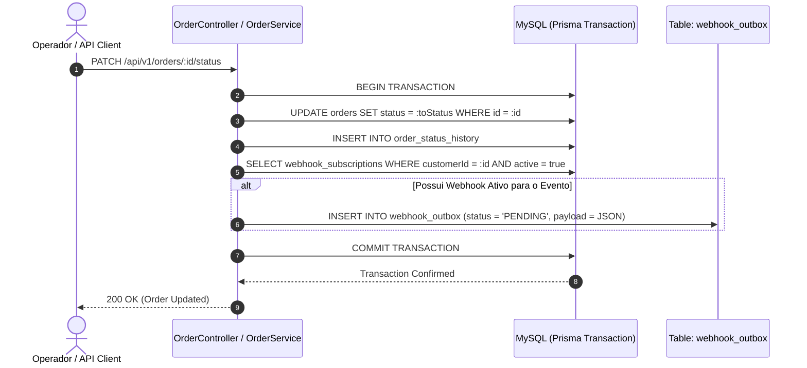
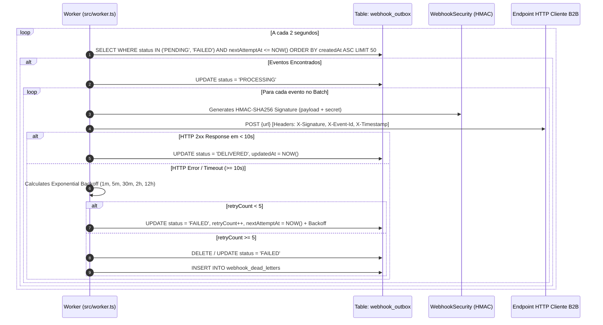
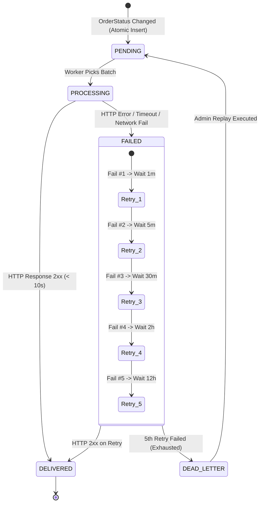

# FDD-001: Especificação Técnica do Sistema de Webhooks de Notificação de Pedidos

## 1. Contexto e Motivação Técnica

O OMS (Order Management System) é estruturado como um monólito modular desenvolvido em Node.js com TypeScript, utilizando Express para a camada HTTP, Prisma como ORM e MySQL 8 como banco de dados relacional. A aplicação organiza seu código-fonte na pasta `src/modules/`, separando domínios em subdiretórios como `auth`, `users`, `customers`, `products` e `orders`.

Atualmente, qualquer alteração no ciclo de vida de um pedido (representado pelo enum `OrderStatus`: `PENDING`, `PAID`, `PROCESSING`, `SHIPPED`, `DELIVERED`, `CANCELLED`) é tratada de forma síncrona dentro de `src/modules/orders/order.service.ts` no método `changeStatus`.

Com a demanda de integração apresentada por clientes B2B (Atlas Comercial, MaxDistribuição e Nova Cargo) [`TRANSCRICAO.md:18-19`](file:///Users/marianasanches/Desktop/mba-design-docs/TRANSCRICAO.md#L18-L19), torna-se necessário notificar sistemas externos sobre essas alterações em tempo quase-real. Fazer disparos HTTP síncronos dentro da transação principal de pedidos degradaria a performance, tornaria o tempo de resposta da API dependente de terceiros e causaria rollbacks inadequados no banco de dados.

A presente especificação técnica detalha a implementação do **Sistema de Webhooks Outbound de Notificação de Pedidos**, integrando o **Transactional Outbox Pattern** com um **Polling Worker autônomo**, garantindo desacoplamento transacional, resiliência, segurança criptográfica e previsibilidade operacional.

---

## 2. Objetivos Técnicos

* **Latência de Entrega:** Latência fim-a-fim da notificação (tempo entre o commit da alteração do pedido no banco de dados e o recebimento pelo endpoint de destino) inferior a 10 segundos para 99% das entregas sob carga nominal [`TRANSCRICAO.md:20-22`](file:///Users/marianasanches/Desktop/mba-design-docs/TRANSCRICAO.md#L20-L22).
* **Garantia de Entrega At-Least-Once:** Zero perda de eventos auditáveis. Todo evento commitado na transação do pedido deve ser registrado na tabela `webhook_outbox` e enviado ao menos uma vez [`TRANSCRICAO.md:144-145`](file:///Users/marianasanches/Desktop/mba-design-docs/TRANSCRICAO.md#L144-L145).
* **Isolamento de Falhas e Tolerância a Desastres:** Falhas ou lentidões em endpoints de clientes externos não podem travar threads da API Web nem afetar outros clientes. Retentativas são tratadas em background e falhas definitivas isoladas em uma Dead Letter Queue (DLQ) [`TRANSCRICAO.md:108-111`](file:///Users/marianasanches/Desktop/mba-design-docs/TRANSCRICAO.md#L108-L111).
* **Segurança Criptográfica:** Garantia de integridade e não-repúdio via assinaturas **HMAC-SHA256** (`X-Signature`), segredos individuais por cadastro com rotação em *grace period* de 24 horas e obrigatoriedade de transporte sob **HTTPS** [`TRANSCRICAO.md:118-138`](file:///Users/marianasanches/Desktop/mba-design-docs/TRANSCRICAO.md#L118-L138).

---

## 3. Escopo Técnico e Exclusões

### Em Escopo (Fase 1)
1. **Modelagem Prisma:** Definição e migração dos modelos `WebhookSubscription`, `WebhookOutbox` e `WebhookDeadLetter` em `prisma/schema.prisma`.
2. **Hooking Atômico:** Integração da publicação de eventos dentro da transação `prisma.$transaction` do método `OrderService.changeStatus`.
3. **Módulo de Gestão de Webhooks (`src/modules/webhooks/`):** Rotas, Controller, Service e Schemas Zod para CRUD de webhooks e rotação de segredos.
4. **Worker de Polling Autônomo (`src/worker.ts`):** Ponto de entrada independente com loop de polling (2s) para consumo de batches de outbox e envio HTTP resiliente.
5. **Estratégia de Retry e DLQ:** Algoritmo de Backoff Exponencial em 5 tentativas (1m, 5m, 30m, 2h, 12h) e transição para `webhook_dead_letters`.
6. **Endpoint Admin de Replay:** Rota `POST /api/v1/admin/webhooks/dead-letter/:id/replay` protegida por autenticação JWT e autorização RBAC (`UserRole.ADMIN`).

### Exclusões Técnicas (Fase 1)
* Brokers de mensageria dedicados (Redis Streams, RabbitMQ, Apache Kafka) [`TRANSCRICAO.md:50-52`](file:///Users/marianasanches/Desktop/mba-design-docs/TRANSCRICAO.md#L50-L52).
* Protocolos bi-direcionais (WebSockets, gRPC, Server-Sent Events).
* Interface gráfica / Dashboard no Frontend [`TRANSCRICAO.md:232-237`](file:///Users/marianasanches/Desktop/mba-design-docs/TRANSCRICAO.md#L232-L237).
* Envio de e-mails automáticos de alerta de falha [`TRANSCRICAO.md:218-223`](file:///Users/marianasanches/Desktop/mba-design-docs/TRANSCRICAO.md#L218-L223).
* Rate limiting ativo por cliente no worker (adiado para Fase 2) [`TRANSCRICAO.md:224-230`](file:///Users/marianasanches/Desktop/mba-design-docs/TRANSCRICAO.md#L224-L230).

---

## 4. Integração Cirúrgica com o Sistema Existente

O acoplamento da nova feature ao código legado do repositório é detalhado a seguir:

### 1. Modelo de Dados (`prisma/schema.prisma`)
Adição dos enums e tabelas necessárias para gerenciar as inscrições, outbox e DLQ:

```prisma
enum WebhookStatus {
  PENDING
  PROCESSING
  DELIVERED
  FAILED
}

model WebhookSubscription {
  id              String        @id @default(uuid()) @db.Char(36)
  customerId      String        @db.Char(36)
  url             String        @db.VarChar(500)
  secret          String        @db.VarChar(255)
  previousSecret  String?       @db.VarChar(255)
  secretExpiresAt DateTime?
  events          Json          // Array de strings com os OrderStatus escutados (ex: ["PAID", "SHIPPED"])
  active          Boolean       @default(true)
  createdAt       DateTime      @default(now())
  updatedAt       DateTime      @updatedAt

  customer        Customer      @relation(fields: [customerId], references: [id], onDelete: Cascade)
  outboxEvents    WebhookOutbox[]

  @@index([customerId])
  @@index([active])
  @@map("webhook_subscriptions")
}

model WebhookOutbox {
  id             String              @id @default(uuid()) @db.Char(36)
  subscriptionId String              @db.Char(36)
  eventId        String              @default(uuid()) @db.Char(36)
  eventType      String              @db.VarChar(100)
  payload        Json
  status         WebhookStatus       @default(PENDING)
  retryCount     Int                 @default(0)
  nextAttemptAt  DateTime            @default(now())
  lastError      String?             @db.Text
  createdAt      DateTime            @default(now())
  updatedAt      DateTime            @updatedAt

  subscription   WebhookSubscription @relation(fields: [subscriptionId], references: [id], onDelete: Cascade)

  @@index([status, nextAttemptAt])
  @@index([subscriptionId])
  @@map("webhook_outbox")
}

model WebhookDeadLetter {
  id             String   @id @default(uuid()) @db.Char(36)
  outboxId       String   @db.Char(36)
  subscriptionId String   @db.Char(36)
  eventId        String   @db.Char(36)
  payload        Json
  failureReason  String   @db.Text
  attemptsMade   Int
  failedAt       DateTime @default(now())

  @@index([subscriptionId])
  @@index([failedAt])
  @@map("webhook_dead_letters")
}
```

### 2. Transação do Pedido ([`src/modules/orders/order.service.ts`](file:///Users/marianasanches/Desktop/mba-design-docs/src/modules/orders/order.service.ts#L126-L179))
Injeção da gravação atômica na outbox dentro do método `changeStatus`:

```typescript
// Trecho de alteração em src/modules/orders/order.service.ts
async changeStatus(
  id: string,
  input: UpdateOrderStatusInput,
  userId: string,
): Promise<OrderWithRelations> {
  return this.prisma.$transaction(async (tx) => {
    // 1. Busca e validações existentes do pedido...
    const order = await tx.order.findUnique({ where: { id }, include: { items: true } });
    if (!order) throw new NotFoundError('Order');
    const from = order.status;
    const to = input.toStatus;
    // ... validações de canTransition e estoque ...

    // 2. Updates existentes no banco...
    await tx.order.update({ where: { id }, data: { status: to } });
    await tx.orderStatusHistory.create({
      data: { orderId: id, fromStatus: from, toStatus: to, changedById: userId, reason: input.reason ?? null },
    });

    // 3. NOVO: Publicação Atômica do Evento no Webhook Outbox
    await publishWebhookOutboxEvent(tx, {
      orderId: order.id,
      orderNumber: order.orderNumber,
      customerId: order.customerId,
      fromStatus: from,
      toStatus: to,
      totalCents: order.totalCents,
      subtotalCents: order.subtotalCents,
      discountCents: order.discountCents,
    });

    const refreshed = await tx.order.findUnique({
      where: { id },
      include: {
        items: { include: { product: { select: { id: true, sku: true, name: true } } } },
        history: { orderBy: { changedAt: 'asc' } },
        customer: { select: { id: true, name: true, email: true } },
      },
    });
    return refreshed!;
  });
}
```

Função auxiliar em `src/modules/webhooks/webhook.publisher.ts`:
```typescript
export async function publishWebhookOutboxEvent(
  tx: Prisma.TransactionClient,
  data: {
    orderId: string;
    orderNumber: string;
    customerId: string;
    fromStatus: OrderStatus;
    toStatus: OrderStatus;
    totalCents: number;
    subtotalCents: number;
    discountCents: number;
  },
): Promise<void> {
  // Busca apenas inscrições ativas do cliente que escutam o toStatus
  const subscriptions = await tx.webhookSubscription.findMany({
    where: {
      customerId: data.customerId,
      active: true,
    },
  });

  const matchingSubscriptions = subscriptions.filter((sub) => {
    const events = sub.events as string[];
    return events.includes(data.toStatus);
  });

  if (matchingSubscriptions.length === 0) return;

  const eventId = crypto.randomUUID();
  const timestamp = new Date().toISOString();

  for (const sub of matchingSubscriptions) {
    const payload = {
      event_id: eventId,
      event_type: 'order.status_changed',
      timestamp,
      data: {
        order_id: data.orderId,
        order_number: data.orderNumber,
        customer_id: data.customerId,
        from_status: data.fromStatus,
        to_status: data.toStatus,
        subtotal_cents: data.subtotalCents,
        discount_cents: data.discountCents,
        total_cents: data.totalCents,
      },
    };

    await tx.webhookOutbox.create({
      data: {
        subscriptionId: sub.id,
        eventId,
        eventType: 'order.status_changed',
        payload,
        status: 'PENDING',
      },
    });
  }
}
```

### 3. Hierarquia de Erros ([`src/shared/errors/http-errors.ts`](file:///Users/marianasanches/Desktop/mba-design-docs/src/shared/errors/http-errors.ts))
Adição das novas exceções específicas estendendo `AppError`:

```typescript
export class WebhookNotFoundError extends NotFoundError {
  constructor() {
    super('Webhook subscription not found');
    this.errorCode = 'WEBHOOK_NOT_FOUND';
  }
}

export class WebhookInvalidUrlError extends BadRequestError {
  constructor(reason: string) {
    super(`Invalid webhook URL: ${reason}`, 'WEBHOOK_INVALID_URL');
  }
}

export class WebhookReplayForbiddenError extends ForbiddenError {
  constructor() {
    super('Only ADMIN users can replay dead letter webhooks', 'WEBHOOK_REPLAY_FORBIDDEN');
  }
}
```

### 4. Reutilização de Middlewares ([`src/middlewares/auth.middleware.ts`](file:///Users/marianasanches/Desktop/mba-design-docs/src/middlewares/auth.middleware.ts))
Os endpoints de CRUD de webhooks utilizam `authenticateToken`, enquanto a rota de Replay de DLQ exige `requireRole(UserRole.ADMIN)`.

### 5. Registro de Rotas e Entry Points ([`src/app.ts`](file:///Users/marianasanches/Desktop/mba-design-docs/src/app.ts) e `src/worker.ts`)
* Em `src/routes/index.ts`, inclusão da rota `/webhooks` e `/admin/webhooks`.
* Criação de `src/worker.ts` como ponto de entrada autônomo.

---

## 5. Fluxos Detalhados de Execução

### Fluxo 1: Criação e Enfileiramento do Evento (Transação Atômica)



---

### Fluxo 2: Loop de Processamento do Polling Worker



---

### Fluxo 3: Ciclo de Vida de Retentativas e Transição para DLQ



---

## 6. Contratos Públicos da API

### 1. `POST /api/v1/webhooks` — Criar Assinatura de Webhook
* **Headers:** `Authorization: Bearer <token>`, `Content-Type: application/json`
* **Request Body:**
```json
{
  "customerId": "f8e7d6c5-b4a3-2109-8765-43210fedcba9",
  "url": "https://api.atlascomercial.com.br/v1/webhooks/orders",
  "events": ["PAID", "PROCESSING", "SHIPPED", "DELIVERED", "CANCELLED"]
}
```
* **Response Body (201 Created):**
```json
{
  "id": "9b1deb4d-3b7d-4bad-9bdd-2b0d7b3dcb6d",
  "customerId": "f8e7d6c5-b4a3-2109-8765-43210fedcba9",
  "url": "https://api.atlascomercial.com.br/v1/webhooks/orders",
  "secret": "whsec_7f9a8b1c2d3e4f5a6b7c8d9e0f1a2b3c4d5e6f7a8b9c0d1e2f3a4b5c6d7e8f9a",
  "events": ["PAID", "PROCESSING", "SHIPPED", "DELIVERED", "CANCELLED"],
  "active": true,
  "createdAt": "2026-08-26T17:30:00.000Z",
  "updatedAt": "2026-08-26T17:30:00.000Z"
}
```

---

### 2. `PATCH /api/v1/webhooks/:id` — Atualizar Webhook
* **Headers:** `Authorization: Bearer <token>`, `Content-Type: application/json`
* **Request Body:**
```json
{
  "url": "https://api.atlascomercial.com.br/v2/webhooks/orders",
  "events": ["SHIPPED", "DELIVERED"],
  "active": true
}
```
* **Response Body (200 OK):**
```json
{
  "id": "9b1deb4d-3b7d-4bad-9bdd-2b0d7b3dcb6d",
  "customerId": "f8e7d6c5-b4a3-2109-8765-43210fedcba9",
  "url": "https://api.atlascomercial.com.br/v2/webhooks/orders",
  "events": ["SHIPPED", "DELIVERED"],
  "active": true,
  "updatedAt": "2026-08-26T17:35:00.000Z"
}
```

---

### 3. `POST /api/v1/webhooks/:id/rotate-secret` — Rotacionar Secret
* **Headers:** `Authorization: Bearer <token>`
* **Request Body:** `{}`
* **Response Body (200 OK):**
```json
{
  "id": "9b1deb4d-3b7d-4bad-9bdd-2b0d7b3dcb6d",
  "newSecret": "whsec_8a9b0c1d2e3f4a5b6c7d8e9f0a1b2c3d4e5f6a7b8c9d0e1f2a3b4c5d6e7f8a9b",
  "previousSecretExpiresAt": "2026-08-27T17:40:00.000Z",
  "message": "Secret rotated successfully. Previous secret remains valid for 24 hours."
}
```

---

### 4. `GET /api/v1/webhooks/:id/deliveries` — Histórico de Entregas
* **Headers:** `Authorization: Bearer <token>`
* **Query Params:** `page=1&pageSize=20`
* **Response Body (200 OK):**
```json
{
  "data": [
    {
      "id": "a1c2e3g4-i5k6-m7o8-q9s0-u1w2y3z4a5b6",
      "eventId": "c39a823b-5e4d-4b8d-932d-123456789abc",
      "eventType": "order.status_changed",
      "status": "DELIVERED",
      "retryCount": 0,
      "lastError": null,
      "createdAt": "2026-08-26T17:42:00.000Z",
      "updatedAt": "2026-08-26T17:42:02.000Z"
    }
  ],
  "meta": {
    "page": 1,
    "pageSize": 20,
    "total": 1,
    "totalPages": 1
  }
}
```

---

### 5. `POST /api/v1/admin/webhooks/dead-letter/:id/replay` — Replay Admin de DLQ
* **Headers:** `Authorization: Bearer <admin_token>`
* **Request Body:** `{}`
* **Response Body (200 OK):**
```json
{
  "message": "Event successfully re-enqueued to outbox from dead letter queue",
  "deadLetterId": "dlq_11223344-5566-7788-9900-aabbccddeeff",
  "newOutboxId": "out_99887766-5544-3322-1100-ffaaddeebbcc",
  "eventId": "c39a823b-5e4d-4b8d-932d-123456789abc",
  "replayedByUserId": "usr_admin_123456789"
}
```

---

### 6. Contrato do Payload de Notificação de Saída (Outbound Dispatch)

O Worker realiza uma chamada `POST` para a URL do cliente B2B configurada.

#### Headers Enviados pelo Worker:
```http
POST /v1/webhooks/orders HTTP/1.1
Host: api.atlascomercial.com.br
Content-Type: application/json
User-Agent: OMS-Webhook-Engine/1.0
X-Event-Id: c39a823b-5e4d-4b8d-932d-123456789abc
X-Webhook-Id: 9b1deb4d-3b7d-4bad-9bdd-2b0d7b3dcb6d
X-Signature: 8f3c2a1b9e0d7f6c5b4a3e2d1c0b9a8f7e6d5c4b3a2f1e0d9c8b7a6f5e4d3c2b
X-Timestamp: 2026-08-26T17:42:00.000Z
```

#### Payload JSON Snapshot:
```json
{
  "event_id": "c39a823b-5e4d-4b8d-932d-123456789abc",
  "event_type": "order.status_changed",
  "timestamp": "2026-08-26T17:42:00.000Z",
  "data": {
    "order_id": "a1b2c3d4-e5f6-7a8b-9c0d-1234567890ab",
    "order_number": "ORD-000042",
    "customer_id": "f8e7d6c5-b4a3-2109-8765-43210fedcba9",
    "from_status": "PAID",
    "to_status": "PROCESSING",
    "subtotal_cents": 15000,
    "discount_cents": 1000,
    "total_cents": 14000
  }
}
```

---

## 7. Matriz de Erros Previstos (Padrão WEBHOOK_*)

| Código de Erro | HTTP Status | Cenário de Disparo | Payload JSON de Resposta |
| :--- | :---: | :--- | :--- |
| `WEBHOOK_NOT_FOUND` | 404 | Tentativa de buscar, editar ou excluir webhook inexistente. | `{"error": "AppError", "errorCode": "WEBHOOK_NOT_FOUND", "message": "Webhook subscription not found"}` |
| `WEBHOOK_INVALID_URL` | 400 | Cadastro de URL com protocolo HTTP ou sintaxe incorreta. | `{"error": "ValidationError", "errorCode": "WEBHOOK_INVALID_URL", "message": "Invalid webhook URL: Must use HTTPS protocol"}` |
| `WEBHOOK_INVALID_EVENT_TYPE` | 400 | Evento informado não pertence ao enum `OrderStatus`. | `{"error": "ValidationError", "errorCode": "WEBHOOK_INVALID_EVENT_TYPE", "message": "Invalid event type: INVALID_STATUS"}` |
| `WEBHOOK_SECRET_REQUIRED` | 400 | Operação de validação executada sem a chave secreta. | `{"error": "ValidationError", "errorCode": "WEBHOOK_SECRET_REQUIRED", "message": "Secret is required"}` |
| `WEBHOOK_PAYLOAD_TOO_LARGE` | 422 | Payload compilado ultrapassa o limite máximo de 64 KB. | `{"error": "UnprocessableEntityError", "errorCode": "WEBHOOK_PAYLOAD_TOO_LARGE", "message": "Compiled webhook payload exceeds 64KB limit"}` |
| `WEBHOOK_REPLAY_FORBIDDEN` | 403 | Usuário sem role `ADMIN` tenta executar Replay na DLQ. | `{"error": "ForbiddenError", "errorCode": "WEBHOOK_REPLAY_FORBIDDEN", "message": "Only ADMIN users can replay dead letter webhooks"}` |
| `WEBHOOK_DELIVERY_TIMEOUT` | 504 | Endpoint do cliente não respondeu em até 10.000 ms. | Registrado no log/lastError do Worker: `"Timeout of 10000ms exceeded"` |
| `WEBHOOK_INACTIVE` | 409 | Operação solicitada para uma inscrição desativada. | `{"error": "ConflictError", "errorCode": "WEBHOOK_INACTIVE", "message": "Webhook subscription is currently inactive"}` |

---

## 8. Estratégias de Resiliência e Tolerância a Falhas

### Timeout HTTP Estrito
O client HTTP utilizado pelo worker (ex: `axios` ou `fetch` nativo com `AbortController`) configura um timeout de **10.000 ms**. Caso o endpoint do cliente B2B não responda nesse intervalo, a requisição é cancelada imediatamente e tratada como falha (`WEBHOOK_DELIVERY_TIMEOUT`), liberando o Worker para o próximo item.

### Algoritmo de Backoff Exponencial
Quando uma tentativa falha, a data da próxima tentativa (`nextAttemptAt`) é calculada a partir do tempo atual adicionado da duração da tentativa corrente:
- `Attempt 1`: `now + 1 minuto`
- `Attempt 2`: `now + 5 minutos`
- `Attempt 3`: `now + 30 minutos`
- `Attempt 4`: `now + 2 horas`
- `Attempt 5`: `now + 12 horas`

### Assinatura HMAC com Validação Durante Rotação
Durante a janela de 24 horas de rotação de segredo, o worker gera a assinatura HMAC-SHA256 utilizando a nova chave (`secret`). Se o cliente B2B ainda não tiver atualizado a chave do seu lado, ele pode validar a assinatura usando a chave antiga (`previousSecret`) que permanece válida até que `secretExpiresAt` expire.

### Proteção contra Memory Leaks no Node.js
O worker processa mensagens em batches com tamanho limitado (ex: 50 itens por ciclo de 2s), garantindo um footprint de memória estável e prevenindo gargalos de garbage collector.

---

## 9. Observabilidade e Telemetria

### Métricas Chave (Prometheus / OpenTelemetry)
- `webhook_outbox_queue_depth`: Gauge indicando a quantidade de registros pendentes na outbox com status `PENDING`.
- `webhook_delivery_attempts_total{status="success|failed", code="2xx|4xx|5xx|timeout"}`: Counter de disparos efetuados.
- `webhook_delivery_latency_seconds`: Histogram medindo a latência da requisição HTTP de saída.
- `webhook_dlq_total`: Counter de mensagens enviadas para a Dead Letter Queue.

### Logs Estruturados (Pino Logger)
Todos os logs do worker seguem a estrutura JSON padronizada da aplicação:

```json
{
  "level": 30,
  "time": 1787689320000,
  "pid": 1234,
  "hostname": "oms-worker-node-1",
  "module": "webhook-worker",
  "eventId": "c39a823b-5e4d-4b8d-932d-123456789abc",
  "subscriptionId": "9b1deb4d-3b7d-4bad-9bdd-2b0d7b3dcb6d",
  "customerId": "f8e7d6c5-b4a3-2109-8765-43210fedcba9",
  "attempt": 1,
  "durationMs": 342,
  "httpStatus": 200,
  "msg": "Webhook event delivered successfully"
}
```

---

## 10. Critérios de Aceite Técnicos e Validação

- [ ] **Atomacidade Transacional:** Garantir via teste de integração que uma falha forçada na inserção da outbox dá rollback na alteração do status do pedido e no histórico.
- [ ] **Validação HTTPS:** Verificar que cadastros de webhook com URL `http://` são rejeitados com erro `WEBHOOK_INVALID_URL`.
- [ ] **SLA de Latência:** Validar em ambiente de staging que 99% das mensagens são entregues em menos de 10 segundos.
- [ ] **Desduplicação (`X-Event-Id`):** Confirmar que todas as retentativas de um mesmo evento enviam o exato mesmo `X-Event-Id`.
- [ ] **Validação HMAC:** Testar o cálculo do HMAC-SHA256 no recebimento simulado do payload, confirmando que alterações de 1 caractere no corpo invalidam a assinatura.
- [ ] **Transição DLQ:** Confirmar que após a 5ª falha o registro é devidamente movido para `webhook_dead_letters`.
- [ ] **Replay Admin (RBAC):** Garantir que requisições ao endpoint `/admin/webhooks/dead-letter/:id/replay` com token de operador (`role: OPERATOR`) retornam `403 Forbidden`.
